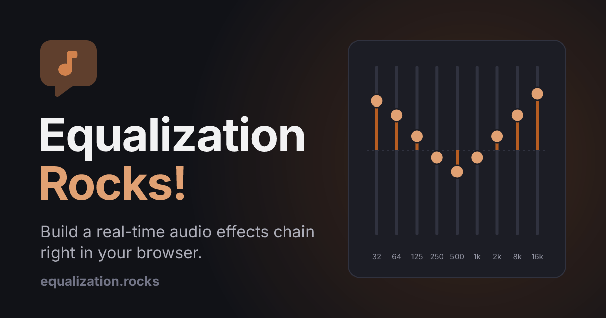

# 🎚️ Equalization Rocks!

[](https://equalization.rocks/)

## What is this?

[Equalization Rocks!](https://equalization.rocks/) is an audio workbench that runs entirely in your browser. On the **Signal Chain** tab, you load a song, stack effects between the source and your speakers, and hear each change as you drag a slider. On the **Mixer** tab, you load a multitrack recording and balance every instrument into one finished song. Playback and processing happen on your device with the [Web Audio API](https://developer.mozilla.org/en-US/docs/Web/API/Web_Audio_API), so your audio is never uploaded.

### Signal Chain

- 🎚️ A 9-band graphic EQ from 32 Hz to 16 kHz
- 🗜️ A compressor with threshold, ratio, attack, and release
- 🔁 Delay with feedback and a dry/wet mix
- ⛪ Reverb that ranges from a small closet to a cathedral
- ⚡ Soft-clip distortion with drive and mix
- 🚪 A noise gate that silences everything below its threshold
- ↔️ A stereo panner
- 🔀 Effects you can add, reorder, and remove while the song plays
- 📁 Drag-and-drop audio files of any format your browser can play

### Mixer

- 📦 Load a .zip of multitrack WAV or AIFF files, or several audio files at once
- 🎛️ A channel strip per track with a gate, compression, three-band EQ, drive, pan, echo and reverb sends, mute, solo, a fader, and a level meter
- 🎯 Every track plays in sample-accurate sync, so drums recorded with several mics stay in phase
- ⏳ Playback can start a few seconds after loading while the rest unpacks in the background
- ⏯️ Start, Stop, and a seek bar for the whole session
- 🔊 A Master card with shared reverb and echo, a master fader, and stereo meters

The Mixer needs Chrome 103, Firefox 114, Safari 16.4, or newer. Unpacked tracks live in your browser's storage until you load another session, so a large session can need a few gigabytes of free disk space. A private window keeps them in memory instead.

### Everywhere

- 💬 Plain-language explanations for every effect and its settings
- 🌗 Light, dark, and automatic themes

## Running Locally

There is no build step. Serve the folder with any static file server:

```sh
uv run python -m http.server
```

Then open `http://localhost:8000`. The UI comes from a [Web Awesome Pro](https://webawesome.com/) kit loaded in `index.html`, so a fork needs its own kit in place of mine.

## Icons and Social Cards

`assets/` holds the favicon, app icons, web app manifest, and Open Graph card. The PNGs and `favicon.ico` are rendered from the glyph in `assets/favicon.svg`, so regenerate them after changing it:

```sh
uv run assets/generate.py
```

## License

The source code is under the MIT License (MIT). `assets/favicon.svg` and the images rendered from it are Font Awesome Pro artwork, © Fonticons, Inc., used under the Font Awesome Pro license and not covered by the grant below.

Copyright © 2026 Leo Herzog

Permission is hereby granted, free of charge, to any person obtaining a copy of this software and associated documentation files (the "Software"), to deal in the Software without restriction, including without limitation the rights to use, copy, modify, merge, publish, distribute, sublicense, and/or sell copies of the Software, and to permit persons to whom the Software is furnished to do so, subject to the following conditions:

The above copyright notice and this permission notice shall be included in all copies or substantial portions of the Software.

THE SOFTWARE IS PROVIDED "AS IS", WITHOUT WARRANTY OF ANY KIND, EXPRESS OR IMPLIED, INCLUDING BUT NOT LIMITED TO THE WARRANTIES OF MERCHANTABILITY, FITNESS FOR A PARTICULAR PURPOSE AND NONINFRINGEMENT. IN NO EVENT SHALL THE AUTHORS OR COPYRIGHT HOLDERS BE LIABLE FOR ANY CLAIM, DAMAGES OR OTHER LIABILITY, WHETHER IN AN ACTION OF CONTRACT, TORT OR OTHERWISE, ARISING FROM, OUT OF OR IN CONNECTION WITH THE SOFTWARE OR THE USE OR OTHER DEALINGS IN THE SOFTWARE.

## About Me

<a href="https://herzog.tech/" target="_blank">
  <picture>
    <source media="(prefers-color-scheme: dark)" srcset="https://herzog.tech/signature/link-light.svg.png">
    <source media="(prefers-color-scheme: light)" srcset="https://herzog.tech/signature/link.svg.png">
    
  </picture>
</a>
<a href="https://mastodon.social/@herzog" target="_blank">
  <picture>
    <source media="(prefers-color-scheme: dark)" srcset="https://herzog.tech/signature/mastodon-light.svg.png">
    <source media="(prefers-color-scheme: light)" srcset="https://herzog.tech/signature/mastodon.svg.png">
    
  </picture>
</a>
<a href="https://github.com/leoherzog" target="_blank">
  <picture>
    <source media="(prefers-color-scheme: dark)" srcset="https://herzog.tech/signature/github-light.svg.png">
    <source media="(prefers-color-scheme: light)" srcset="https://herzog.tech/signature/github.svg.png">
    
  </picture>
</a>
<a href="https://keybase.io/leoherzog" target="_blank">
  <picture>
    <source media="(prefers-color-scheme: dark)" srcset="https://herzog.tech/signature/keybase-light.svg.png">
    <source media="(prefers-color-scheme: light)" srcset="https://herzog.tech/signature/keybase.svg.png">
    
  </picture>
</a>
<a href="https://www.linkedin.com/in/leoherzog" target="_blank">
  <picture>
    <source media="(prefers-color-scheme: dark)" srcset="https://herzog.tech/signature/linkedin-light.svg.png">
    <source media="(prefers-color-scheme: light)" srcset="https://herzog.tech/signature/linkedin.svg.png">
    
  </picture>
</a>
<a href="https://hope.edu/directory/people/herzog-leo/" target="_blank">
  <picture>
    <source media="(prefers-color-scheme: dark)" srcset="https://herzog.tech/signature/anchor-light.svg.png">
    <source media="(prefers-color-scheme: light)" srcset="https://herzog.tech/signature/anchor.svg.png">
    
  </picture>
</a>
<br />
<a href="https://herzog.tech/$" target="_blank">
  <picture>
    <source media="(prefers-color-scheme: dark)" srcset="https://herzog.tech/signature/mug-tea-saucer-solid-light.svg.png">
    <source media="(prefers-color-scheme: light)" srcset="https://herzog.tech/signature/mug-tea-saucer-solid.svg.png">
    
  </picture>
  Found this helpful? Buy me a tea!
</a>
